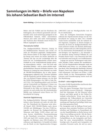
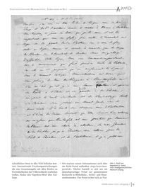

# Data Input

* list of PDF papers, via [fatcat](https://fatcat.wiki), and [fatcat-cli](https://gitlab.com/bnewbold/fatcat-cli)

```
$ for ident in $(fatcat-cli search release --entity-json "urban gardening in_ia:true" | \
    jq -r .ident); do fatcat-cli download "release_$ident"; done
```

Download PDFs, inspect manually, whether we could use it. A complete automatic
dataset generation may be possible, too.

## Dataset Mini

* 102 examples per class

To create:

```
$ make -j 24
```

A few PNG files should be generated:

```
$ ll -1 | head
.gitignore
Makefile
README.md
release_2bqpbjba25fbldbgnururjjfve.1.png
release_2bqpbjba25fbldbgnururjjfve.2.png
release_2bqpbjba25fbldbgnururjjfve.pdf
release_2n2fdhgekfhoroa2ojzlrctxsm.1.png
release_2n2fdhgekfhoroa2ojzlrctxsm.2.png
release_2n2fdhgekfhoroa2ojzlrctxsm.pdf
release_3aumrk2zu5amdcoksqtdcg5bhu.1.png
```

What is the average image aspect ratio?

```
$ find . -name "*png" | python imratio.py
1.3560107200436284
```

We want to shrink the images a bit, trying to keep the ratio. Let's try 600x813
first. Actually, let's try even smaller images (200x271).

Examples:

 

## Convenient preprocessing

```
$ tree -d
.
├── data
│   ├── class_first_page
│   └── class_subsequent_page
└── static

4 directories
```

* [tf.keras.preprocessing.image_dataset_from_directory](https://www.tensorflow.org/api_docs/python/tf/keras/preprocessing/image_dataset_from_directory)
* [image_dataset_from_directory](https://github.com/keras-team/keras/blob/06ba37b8662dea768b3bc8201942f1eb877708e8/keras/preprocessing/image_dataset.py#L33)
* [index_directory](https://github.com/keras-team/keras/blob/06ba37b8662dea768b3bc8201942f1eb877708e8/keras/preprocessing/dataset_utils.py#L26)

All subdirectories are considered; may override with `class_names` parameter.

* [class_names](https://github.com/keras-team/keras/blob/06ba37b8662dea768b3bc8201942f1eb877708e8/keras/preprocessing/dataset_utils.py#L45-L48)
